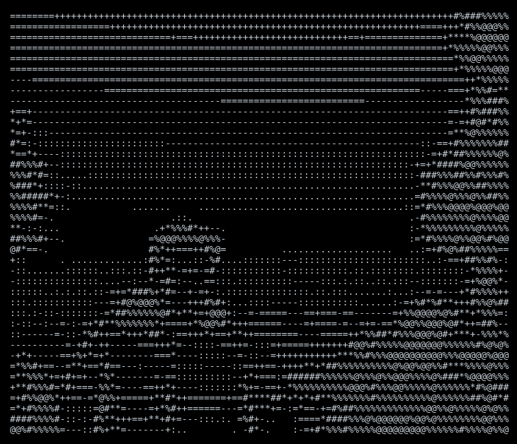

<div align="center">

# 👋 Hi, I'm Aditya Kumar

### `Java` • `C` • `C++` • `SQL` • `Web Development`

</div>

---



---

## 

> Developer focused on learning, building, and improving through real projects.
>
> I enjoy working with Java, C, C++, SQL and web technologies.
>
> Currently improving my problem-solving skills, development workflow, and GitHub projects.

---

## 

```text
Java       ████████████████████
C          ███████████████
C++        ███████████████
SQL        ████████████
HTML/CSS   ███████████████
JavaScript ███████████
Git        ███████████████
GitHub     █████████████████
```

---

## 

### 💬 Java Chat Application

A Java-based chat application focused on communication and networking concepts.

### 🤖 AI Projects

Projects and experiments exploring practical applications of AI and modern technologies.

### 📚 DSA & Programming

Data structures, algorithms, problem solving, and programming practice.

---

## 

<p align="center">
  
  
</p>

<p align="center">
  
  
</p>

---

## 

This profile is built with generated SVG graphics and GitHub Actions.

The statistics are automatically refreshed from GitHub data.

The portrait is generated from my source image using an ASCII character ramp.

---

<div align="center">

### `build • learn • improve • repeat`

</div>
